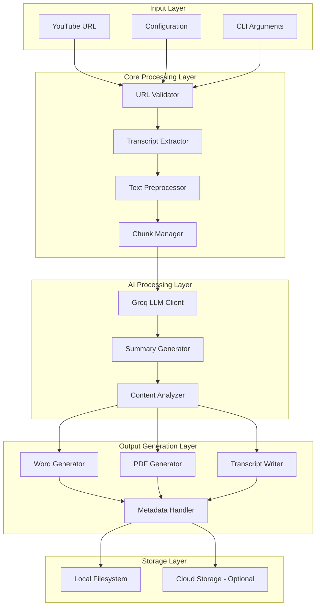
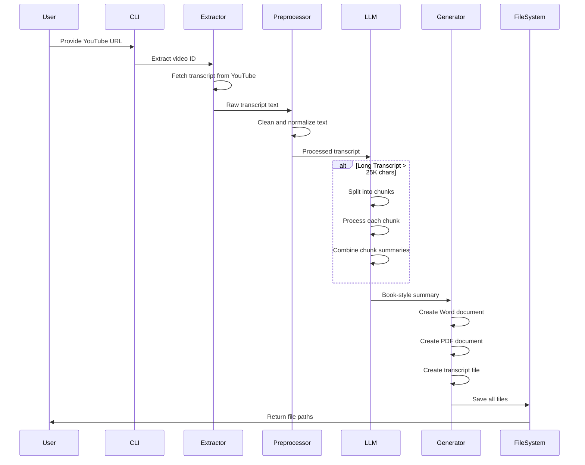

# YouTube to Book Summary Converter - Architecture Plan

## Executive Summary

This document outlines the comprehensive architecture plan for the YouTube to Book Summary Converter - a tool that transforms YouTube video content into professional book-style summaries with multiple output formats.

---

## 1. Current Implementation Analysis

### 1.1 Existing Components

| Component | File | Purpose | Status |
|-----------|------|---------|--------|
| CLI Entry Point | `main.py` | Command-line interface with argparse | ✅ Working |
| Configuration | `config.py` | Environment and settings management | ✅ Working |
| Transcript Extractor | `youtube_transcript.py` | YouTube transcript extraction via API | ✅ Working |
| Groq Client | `groq_client.py` | LLM API wrapper with cost estimation | ✅ Working |
| Summarizer | `summarizer.py` | Main orchestration and file generation | ✅ Working |
| Prompt Template | `youtube_summary.md` | LLM prompt for book-style output | ✅ Working |
| Colab Version | `colab_code.py` | Standalone Google Colab notebook | ✅ Working |

### 1.2 Current Output Files

1. **Book Summary (Word)**: `.docx` file with structured chapters
2. **Book Summary (PDF)**: `.pdf` file with formatted output
3. **Transcript (Word)**: `.docx` file with original transcript text

### 1.3 Identified Issues

| Issue | Severity | Location | Description |
|-------|----------|----------|-------------|
| Exposed API Key | 🔴 Critical | `.env.example` | Real API key committed to repo |
| Variable Name Bug | 🟡 Medium | `main.py:135` | Uses `args.language` instead of `args.lang` |
| Missing Package Init | 🟡 Medium | Root | No `__init__.py` for package install |
| Unused Imports | 🟢 Low | `summarizer.py` | `json`, `Inches`, `Pt` not used |
| Return Type Mismatch | 🟡 Medium | `summarizer.py:456` | Returns tuple but type hint says `Path` |

---

## 2. Proposed Architecture

### 2.1 High-Level Architecture Diagram



### 2.2 Data Flow Diagram



---

## 3. Detailed Component Design

### 3.1 Input Layer

#### 3.1.1 URL Validator
- **Purpose**: Validate and normalize YouTube URLs
- **Input**: Raw URL string
- **Output**: Validated video ID or error
- **Enhancements**:
  - Support more URL formats (shorts, embed, mobile)
  - Add URL sanitization
  - Check video availability before processing

#### 3.1.2 Configuration Manager
- **Purpose**: Centralize all configuration
- **Current**: Basic env var loading
- **Enhancements**:
  - Add validation for required settings
  - Support multiple environments (dev, prod)
  - Add configuration schema validation

### 3.2 Core Processing Layer

#### 3.2.1 Transcript Extractor
- **Current Implementation**: Uses `youtube-transcript-api`
- **Capabilities**:
  - Multi-language support
  - Manual and auto-generated captions
  - Fallback to any available transcript

- **Proposed Enhancements**:
  ```python
  class TranscriptExtractor:
      def extract_with_metadata(url) -> Transcript:
          # Returns: video_id, title, author, duration, language, text
          
      def extract_with_timestamps(url) -> TimestampedTranscript:
          # Returns: text with [00:00] timestamps preserved
          
      def get_available_languages(url) -> List[str]:
          # Returns: list of available caption languages
  ```

#### 3.2.2 Text Preprocessor
- **Purpose**: Clean and normalize transcript text
- **Current**: Basic timestamp removal
- **Proposed Features**:
  - Remove filler words (um, uh, like)
  - Fix common transcription errors
  - Preserve speaker changes
  - Add paragraph detection

#### 3.2.3 Chunk Manager
- **Purpose**: Handle long transcripts efficiently
- **Current**: Simple character-based splitting
- **Proposed Enhancements**:
  - Semantic chunking (split at topic changes)
  - Token-aware chunking
  - Overlap optimization
  - Chapter detection

### 3.3 AI Processing Layer

#### 3.3.1 LLM Client
- **Current**: Groq API with basic error handling
- **Proposed Enhancements**:
  - Retry logic with exponential backoff
  - Rate limit handling
  - Multiple model support with fallback
  - Streaming responses for long outputs

#### 3.3.2 Summary Generator
- **Current**: Single prompt template
- **Proposed Features**:
  - Multiple summary styles (academic, casual, professional)
  - Custom prompt templates
  - Summary length control
  - Focus area specification

### 3.4 Output Generation Layer

#### 3.4.1 Word Document Generator
- **Current**: Basic section-based generation
- **Proposed Enhancements**:
  - Professional styling and themes
  - Table of contents
  - Page headers and footers
  - Custom fonts and colors
  - Image placeholders for video thumbnails

#### 3.4.2 PDF Generator
- **Current**: Basic PDF with reportlab
- **Proposed Enhancements**:
  - Professional layouts
  - Custom cover pages
  - Page numbers
  - Bookmarks for sections
  - Print-optimized formatting

#### 3.4.3 Transcript Writer
- **Current**: Plain text in Word format
- **Proposed Enhancements**:
  - Timestamped transcript option
  - Speaker-labeled transcript
  - Searchable text layer in PDF
  - Side-by-side with summary option
  - **Statistics page with metadata**:
    - Word count calculation
    - Character count
    - Reading time estimation (200 WPM standard)
    - Speaking rate (words per minute)
    - Paragraph count
    - Video duration from YouTube API

---

## 4. Proposed File Structure

```
youtube_summary/
├── src/
│   ├── __init__.py
│   ├── cli/
│   │   ├── __init__.py
│   │   ├── main.py              # CLI entry point
│   │   └── commands.py          # CLI commands
│   ├── core/
│   │   ├── __init__.py
│   │   ├── config.py            # Configuration management
│   │   ├── exceptions.py        # Custom exceptions
│   │   └── constants.py         # Constants and enums
│   ├── extractors/
│   │   ├── __init__.py
│   │   ├── base.py              # Base extractor class
│   │   ├── youtube.py           # YouTube transcript extractor
│   │   └── preprocessor.py      # Text preprocessing
│   ├── ai/
│   │   ├── __init__.py
│   │   ├── base.py              # Base AI client
│   │   ├── groq_client.py       # Groq implementation
│   │   └── prompts/             # Prompt templates
│   │       ├── book_summary.md
│   │       ├── academic.md
│   │       └── quick_notes.md
│   ├── generators/
│   │   ├── __init__.py
│   │   ├── base.py              # Base generator
│   │   ├── word_generator.py    # Word document generation
│   │   ├── pdf_generator.py     # PDF generation
│   │   └── transcript_generator.py
│   └── utils/
│       ├── __init__.py
│       ├── helpers.py           # Utility functions
│       ├── validators.py        # Input validation
│       └── statistics.py        # Transcript statistics calculator
├── tests/
│   ├── __init__.py
│   ├── test_extractors.py
│   ├── test_ai.py
│   └── test_generators.py
├── templates/
│   ├── word_template.docx       # Word template
│   └── pdf_styles.json          # PDF styling config
├── outputs/                     # Default output directory
├── .env.example
├── requirements.txt
├── setup.py
├── pyproject.toml
└── README.md
```

---

## 5. Output File Specifications

### 5.1 Book Summary (Word - .docx)

```
┌─────────────────────────────────────────────────────────────┐
│  COVER PAGE                                                 │
│  ┌─────────────────────────────────────────────────────┐   │
│  │  [Video Thumbnail - Optional]                        │   │
│  │                                                      │   │
│  │  VIDEO TITLE                                         │   │
│  │  Book-Style Summary                                  │   │
│  │                                                      │   │
│  │  Generated: [Date]                                   │   │
│  │  Video ID: [ID]                                      │   │
│  │  Source: [YouTube URL]                               │   │
│  └─────────────────────────────────────────────────────┘   │
├─────────────────────────────────────────────────────────────┤
│  TABLE OF CONTENTS                                          │
│  1. Executive Overview ........................... 1        │
│  2. Introduction .................................. 2        │
│  3. Chapter Summaries ............................ 3        │
│  ...                                                        │
├─────────────────────────────────────────────────────────────┤
│  PAGE 1: EXECUTIVE OVERVIEW                                 │
│  ┌─────────────────────────────────────────────────────┐   │
│  │  [Header: Video Title]                               │   │
│  │  [Page Number: 1]                                    │   │
│  │                                                      │   │
│  │  Comprehensive 2-3 paragraph overview...             │   │
│  │                                                      │   │
│  └─────────────────────────────────────────────────────┘   │
├─────────────────────────────────────────────────────────────┤
│  PAGES 2-N: CHAPTER SUMMARIES                               │
│  [Each chapter on separate page with clear headers]         │
├─────────────────────────────────────────────────────────────┤
│  FINAL PAGES                                                │
│  - Key Takeaways                                            │
│  - Memorable Quotations                                     │
│  - Practical Applications                                   │
│  - Critical Analysis                                        │
│  - Further Reading                                          │
│  - Conclusion                                               │
└─────────────────────────────────────────────────────────────┘
```

### 5.2 Book Summary (PDF - .pdf)

- Same structure as Word
- Print-optimized margins
- Embedded fonts
- Bookmarks for navigation
- Page numbers in footer

### 5.3 Transcript File (Word - .docx)

```
┌─────────────────────────────────────────────────────────────┐
│  COVER PAGE                                                 │
│  TRANSCRIPT: [Video Title]                                  │
│  Original Words by the Content Creator                      │
│                                                             │
│  ┌─────────────────────────────────────────────────────┐   │
│  │  VIDEO METADATA                                      │   │
│  │  ───────────────────────────────────────────────────│   │
│  │  Video ID:        [ID]                               │   │
│  │  Video Duration:  [HH:MM:SS]                         │   │
│  │  Language:        [Language]                         │   │
│  │  Channel:         [Channel Name]                     │   │
│  │  Generated:       [Date]                             │   │
│  │                                                      │   │
│  │  TRANSCRIPT STATISTICS                               │   │
│  │  ───────────────────────────────────────────────────│   │
│  │  Word Count:      [X,XXX words]                      │   │
│  │  Character Count: [XX,XXX characters]                │   │
│  │  Reading Time:    [X minutes]                        │   │
│  │  Speaking Rate:   [XXX words/min]                    │   │
│  │  Paragraphs:      [XX]                               │   │
│  └─────────────────────────────────────────────────────┘   │
├─────────────────────────────────────────────────────────────┤
│  PAGE 1: TRANSCRIPT                                         │
│  ┌─────────────────────────────────────────────────────┐   │
│  │  [00:00] Welcome everyone to this video...           │   │
│  │  [00:15] Today we are going to discuss...            │   │
│  │  [00:30] Let me start by explaining...               │   │
│  │                                                      │   │
│  │  [Original words exactly as spoken]                  │   │
│  │                                                      │   │
│  └─────────────────────────────────────────────────────┘   │
├─────────────────────────────────────────────────────────────┤
│  PAGE 2-N: CONTINUED TRANSCRIPT                             │
│  [Page breaks at logical points]                            │
│  [Timestamps every 30 seconds or at paragraph breaks]       │
├─────────────────────────────────────────────────────────────┤
│  FINAL PAGE: SUMMARY STATISTICS                             │
│  ┌─────────────────────────────────────────────────────┐   │
│  │  TRANSCRIPT SUMMARY                                  │   │
│  │  ───────────────────────────────────────────────────│   │
│  │  Total Words:         [X,XXX]                        │   │
│  │  Total Characters:    [XX,XXX]                       │   │
│  │  Estimated Read Time: [X min at 200 WPM]             │   │
│  │  Video Duration:      [HH:MM:SS]                     │   │
│  │  Speaking Pace:       [XXX words/min]                │   │
│  │  Pages Generated:     [X]                            │   │
│  └─────────────────────────────────────────────────────┘   │
└─────────────────────────────────────────────────────────────┘
```

### 5.4 Transcript Metadata Fields

| Field | Description | Calculation |
|-------|-------------|-------------|
| Word Count | Total words in transcript | `len(text.split())` |
| Character Count | Total characters including spaces | `len(text)` |
| Reading Time | Estimated time to read at 200 WPM | `word_count / 200` minutes |
| Video Duration | Actual video length from YouTube API | YouTube Data API |
| Speaking Rate | Words spoken per minute | `word_count / duration_minutes` |
| Paragraphs | Number of text blocks | Count of `\n\n` + 1 |
| Language | Detected/specified language | From transcript API |
| Channel Name | YouTube channel name | YouTube Data API |
| Video Title | Full video title | YouTube Data API |

---

## 6. Implementation Roadmap

### Phase 1: Critical Fixes (Immediate)

- [ ] **SECURITY**: Remove exposed API key from `.env.example`
- [ ] **BUG FIX**: Fix `args.language` → `args.lang` in `main.py:135`
- [ ] **BUG FIX**: Fix return type annotation in `summarizer.py:456`
- [ ] **CLEANUP**: Remove unused imports from `summarizer.py`

### Phase 2: Code Refactoring

- [ ] Create proper package structure with `__init__.py` files
- [ ] Separate concerns into distinct modules
- [ ] Add type hints throughout codebase
- [ ] Create base classes for extensibility
- [ ] Add comprehensive error handling

### Phase 3: Feature Enhancements

- [ ] Add timestamped transcript option
- [ ] Implement video metadata extraction (title, author, duration)
- [ ] **Add transcript statistics (word count, reading time, speaking rate)**
- [ ] **Add video duration metadata from YouTube API**
- [ ] Add multiple summary style templates
- [ ] Implement retry logic for API calls
- [ ] Add progress indicators for long videos

### Phase 4: Output Improvements

- [ ] Professional Word templates with styling
- [ ] PDF with bookmarks and navigation
- [ ] Cover page with video thumbnail
- [ ] Table of contents generation
- [ ] Page headers and footers

### Phase 5: Testing & Documentation

- [ ] Unit tests for all modules
- [ ] Integration tests
- [ ] API documentation
- [ ] User guide updates
- [ ] Example outputs

### Phase 6: Advanced Features (Future)

- [ ] Web interface (Flask/FastAPI)
- [ ] Batch processing with queue
- [ ] Cloud storage integration
- [ ] Multi-language summary support
- [ ] Speaker diarization for interviews

---

## 7. Technical Specifications

### 7.1 Dependencies

| Package | Current | Recommended | Purpose |
|---------|---------|-------------|---------|
| youtube-transcript-api | >=0.6.2 | >=0.6.2 | Transcript extraction |
| groq | >=0.9.0 | >=0.9.0 | LLM API |
| python-dotenv | >=1.0.0 | >=1.0.0 | Environment management |
| tqdm | >=4.66.0 | >=4.66.0 | Progress bars |
| requests | >=2.31.0 | >=2.31.0 | HTTP requests |
| python-docx | >=1.1.0 | >=1.1.0 | Word generation |
| reportlab | >=4.0.0 | >=4.0.0 | PDF generation |

### 7.2 Python Version Support

- Minimum: Python 3.8
- Recommended: Python 3.10+

### 7.3 API Rate Limits

| Model | Rate Limit | Recommended Usage |
|-------|------------|-------------------|
| llama-3.3-70b-versatile | 30 req/min | Complex summaries |
| llama-3.1-8b-instant | 30 req/min | Quick summaries |

---

## 8. Security Considerations

1. **API Key Management**
   - Never commit real API keys
   - Use environment variables
   - Consider key rotation

2. **Input Validation**
   - Sanitize YouTube URLs
   - Validate file paths
   - Limit transcript size

3. **Output Security**
   - Sanitize generated content
   - Safe file naming
   - Directory traversal prevention

---

## 9. Success Metrics

| Metric | Target | Measurement |
|--------|--------|-------------|
| Processing Time | < 2 min for 30 min video | Time from URL to files |
| Summary Quality | > 90% user satisfaction | User feedback |
| Error Rate | < 5% failures | Error logs |
| Output File Quality | Professional grade | Manual review |

---

## 10. Next Steps

1. **Review this plan** and provide feedback
2. **Prioritize phases** based on immediate needs
3. **Switch to Code mode** to implement changes
4. **Test thoroughly** after each phase
5. **Update documentation** as features are added

---

*Document Version: 1.0*
*Last Updated: 2026-02-12*
